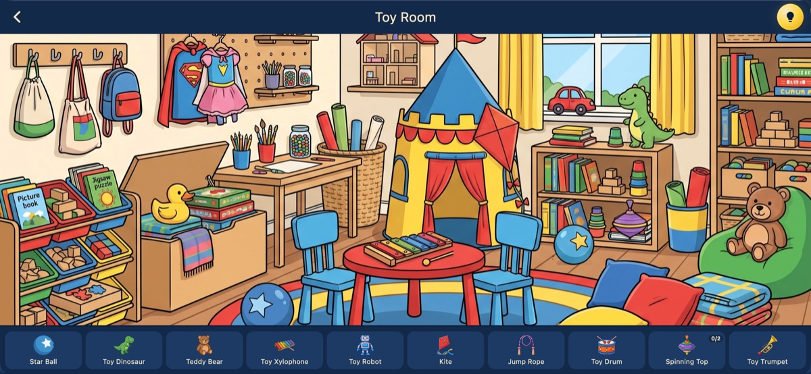
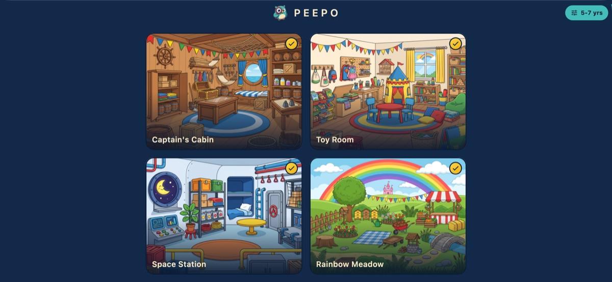
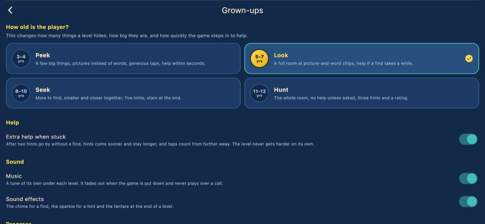

# Peepo

A hidden object game for children aged 3 to 12.
Find everything Peepo the owl has lost, in rooms drawn several times over so no two playthroughs hide the same things.

[](https://github.com/ftomer/peepo/actions/workflows/ci.yml)
[](https://apps.apple.com/app/id6804279043)
[](LICENSE)



| The four rooms | The grown-up screen |
| --- | --- |
|  |  |

Free on the [App Store](https://apps.apple.com/app/id6804279043), and it stays free.
No ads, no timers, no accounts, no analytics, and no network code of any kind.

The same art is played by four age bands - Peek (3-4), Look (5-7), Seek (8-10) and Hunt (11-12) - which are derived from one authored scene rather than built separately.
That derivation is most of what is interesting in the code: see [`lib/models/difficulty.dart`](lib/models/difficulty.dart) and [docs/kids-direction.md](docs/kids-direction.md).
Flutter, no game engine ([docs/tech-stack.md](docs/tech-stack.md)).

The source is public so anyone can read it, learn from it, fix it and add rooms to it.
Contributions are welcome and everyone who lands one is credited: start with [CONTRIBUTING.md](CONTRIBUTING.md).

## Run

```bash
flutter run                    # device/simulator
flutter run -d macos           # desktop
flutter run -d chrome          # web
flutter test                   # unit + widget tests
```

VS Code: pick "Peepo (macOS debug)", "Peepo (iOS Simulator debug)" or
"Peepo (iOS device debug)" from the Run and Debug panel
(see [.vscode/launch.json](.vscode/launch.json)).

## Architecture

- `assets/levels/levels.json` - the catalog: every level the app ships, in play order, with the objects it hides and the copy ceiling (`maxObjects`) the older age bands stop at.
  A level that ships variants lists them under `variants`, each with its own two counts: a variant is a busier room over the same find list, and its regions hold a different number of copies of it.
- `assets/levels/<level>/` - one folder per level, everything that level needs. Every shipped level is baked (see the scene pipeline below), so a folder holds:
  - `scene.<n>.json` - one picture: every find in it, as a stamp, at the place the illustrator drew it. Asset paths inside are relative to the folder.
  - `background.jpg` - the plate every picture of the band shares, and the level-select thumbnail.
  - `baked/<n>_<find>.png` - the stamps: each find's own pixels on transparency, shadow feathered out.
  - `baked/chip_<kind>.png` - the object list's icon for that kind, cut from the sprite sheet rather than out of the picture: one per kind, shared by every picture of the level.
  - `scene.dense.<n>.json`, `background_dense.jpg` - a second, busier room over the same find list, played by the 8-10 and 11-12 bands, plus decoys that are on no list. All four levels ship one; a level without them is played as authored by every band. See [art-direction.md](docs/imgenprompts/art-direction.md#dense-variants).
  - A level that has not been baked yet ships instead a prop catalog (`scene.json`), a room description (`meta.json`) and `sprites/*.png`, and is hidden afresh by the placer every playthrough.
- `assets/audio/music/<level>.mp3` - one track per level, plus `menu.mp3` under the level list. Written by `tools/audio.sh music`.
- `assets/audio/sfx/*.wav` - the cue for a find, a miss, a hint, a hint arriving, a finished level. Written by `tools/audio.sh sfx`.
- `assets/peepo/*.png` - Peepo the owl, one file per pose, cut out by `tools/scene.sh mascot`.
- `lib/game/peepo.dart` - the poses the screens can draw him in, and the widget that draws them.
- `lib/models/level.dart` - level and catalog model: where a level's files live, which level comes next.
- `lib/models/level_progress.dart` - which levels are finished, kept on the device.
- `lib/models/difficulty.dart` - the four age bands (3-4, 5-7, 8-10, 11-12) and everything each one changes: how many objects a level hides, how big, how far apart, how much of one may sit behind the scenery, how many decoys go in beside them, whether a prop is put where it shows or where it hides, which backdrop is played, how solidly a find is drawn over it, how forgiving a tap is, how soon help arrives.
- `lib/models/settings.dart` - what a grown-up chose, kept on the device and nowhere else.
- `lib/models/scene.dart` - scene model, JSON parsing, point-in-polygon hit-testing.
- `lib/models/prop_catalog.dart`, `lib/models/scene_meta.dart` - what a level hides, and the room it hides them in.
- `lib/game/placement.dart` - hides the level: picks a region, size, angle and spot for every prop from a seed, so no two playthroughs are the same. Then fills what is left with decoys - props on no list, which a player has to look at and rule out. Pure Dart, so `dart run tools/layout.dart <level> --seed N [--band peek|look|seek|hunt] [--variant dense]` runs the same placer, at the same age band, outside the app.
- `lib/game/level_select_screen.dart` - the home screen: every level as a card, and the age band in the corner as the way in to the settings. The grid picks its columns for the screen it is on, so the whole catalog is on screen at a glance on a landscape phone and on a tablet alike.
- `lib/game/settings_screen.dart` - the grown-up screen: age band, extra help, start over.
- `lib/game/parental_gate.dart` - the sum in front of every grown-up decision.
- `lib/game/scene_view.dart` - InteractiveViewer render: backdrop, sprites, found/hint/miss animations. The room is drawn cover-style and opened in the middle of itself, so a 4:3 picture on a phone-shaped screen starts on the room rather than on its ceiling.
- `lib/game/game_screen.dart` - plays one level: game state, object list bar, hints, level-complete overlay.
- `lib/game/smoke.dart` - the magical smoke cloud that hides a level while it loads and clears to reveal it.
- `lib/game/audio.dart` - what is playing and when: the track under the screen on top, the cue for everything that happens, and the two switches that turn either off.

Adding a level means adding a folder and a catalog line - no Dart changes.
`tools/scene.sh build` writes both, plus the two `pubspec.yaml` asset lines the
folder needs (Flutter never bundles directories recursively).

A level never appears piecemeal: the scene JSON, backdrop and every sprite are
decoded behind the smoke, and only once all of it is in memory does the cloud
dissipate.

The app opens on the level list and plays whichever level is tapped; finishing
one offers the next. Four levels ship: `pirate_cabin`, `toy_room`,
`space_station` and `rainbow_meadow`, each a backdrop with twelve to fourteen
findable sprites composited on top. See [docs/plan.md](docs/plan.md) for the roadmap.

## Scene pipeline

Raw art lives in `rawimages/`: a backdrop jpeg plus sprite sheets on white.
That folder is not tracked in git, see [Source art](#source-art).
Five staged commands turn that into a playable level.
Full guide in [docs/scene-pipeline.md](docs/scene-pipeline.md), meta schema in [docs/scene-meta.md](docs/scene-meta.md).

```bash
tools/scene.sh analyze <id> --bg <jpeg> --sheets <jpeg> [<jpeg> ...]
tools/scene.sh fit     <id> [--snap] [--spans] [--check]
tools/scene.sh place   <id> [--difficulty easy|medium|hard]
tools/scene.sh build   <id> [--variant dense]
tools/scene.sh preview <id> [--outlines] [--band peek|look|seek|hunt]
```

A variant runs the same stages against its own backdrop, with one step in the middle:

```bash
tools/scene.sh analyze <id> --variant dense --audience dense --bg <dense jpeg> \
               --sheets <sheet> <sheet> <decoy sheet>
tools/scene.sh fit     <id> --variant dense --snap --spans
tools/scene.sh rebase  <id> --variant dense --decoys <id> <id> ...
tools/scene.sh place   <id> --variant dense --difficulty hard
tools/scene.sh build   <id> --variant dense
```

Every level ships **baked scenes**: pictures the illustrator drew the finds into, with no sprites over them at all.
Each level has two plates - a busy room for Peek and Look, a packed one for Seek and Hunt - and four pictures baked from each, so the room changes between playthroughs.
The art is made by handing the model the empty room and asking it to add the finds, so the empty room is a clean plate - which is what lets `tools/scene.sh bake <id> --plate <room>` cut each find out to the pixel.
What ships is the plate and those cut-outs, not the finished pictures: the renderer stamps each find back where the illustrator drew it, so a level with eight layouts carries two backdrops instead of eight, and a find that is tapped simply stops being drawn.
A find may be hidden behind the scenery and may not be cut off by anything else, so a reading that came back sliced by the frame or with nothing left showing is dropped rather than shipped.
The object list's icons are cut from the sprite sheets instead of out of the picture: the bar says what is being looked for, whole and on its own.
See [docs/scene-pipeline.md](docs/scene-pipeline.md#the-other-shape-a-baked-scene) for what that buys, what it costs, and where the variety comes from.
The composited pipeline above is still the code path a new level takes before it is baked, and `test/fixtures/` keeps a room for the placer's own tests.

`fit` is what keeps a find standing on the shelf rather than hovering over it.
The meta file is written by eye and is out by a few percent; `fit` reads the backdrop's own line work, corrects every rest line and box it can, reports the ones it must not guess at, and records where each surface still has room for something ([schema](docs/scene-meta.md#room-on-a-surface)).

`rebase` is the middle step and is the reason the variant is the same level.
Stage 1 reads the sprite sheets fresh every time, so a variant of an existing level comes back with the same art under new names - the meadow's `unicorn_toy` as `pink_unicorn`, its `clover` as `four_leaf_clover`.
`rebase` throws those away, puts the level's own props back, and marks the decoy sheet's six as decoys; `place` then rules on all eighteen against the variant's own room.

A level plays differently at every age, so a preview is a preview of one band.
`--band` picks which, decoys come out outlined in red, and a prop tucked behind the scenery is drawn exactly as short as the game draws it.

`analyze` and `place` are vision steps: they shell out to the `claude` CLI on this machine, so the pipeline needs no API key of its own.
The first run creates `.venv` and installs Pillow.
Budget roughly two dollars and ten minutes per scene, most of it the room analysis.

### Adding a new scene

**1. Drop the art in `rawimages/`.**

One backdrop jpeg of the room, with no findable props painted into it.
One or more sprite sheet jpegs: a grid of props on a plain near-white background, one prop per cell, at any grid size.
Nothing else is configured - grid size, prop ids and player-facing labels are read off the sheets.

**2. Describe the room.**

```bash
tools/scene.sh analyze kids_playroom \
    --bg rawimages/playroom_bg.jpeg \
    --sheets rawimages/playroom_sprite_1.jpeg rawimages/playroom_sprite_2.jpeg \
    --theme "kids playroom" --name "The Playroom"
```

Writes `tools/scenes/kids_playroom.meta.json`, the scene's description: regions, depth, lighting, rest lines and no-go zones.
Also writes `tools/scenes/kids_playroom.build.json` with the props listed and no rules for them yet.

**Read the meta file before going on.**
Every later decision is argued against it, so a region in the wrong place becomes a prop in the wrong place three stages later.
Skim the region list against the picture and correct anything obviously wrong by hand.

**3. Place the props.**

```bash
tools/scene.sh place kids_playroom --difficulty medium
```

Fills in the rules in the build spec, one line per prop: which regions it belongs in, how it can sit there, the widths and angles it may take, and how many of it there can be.
It does not choose spots - the game does that when the level is played, so the room is hidden differently every game.
Every rule is validated against the meta file and re-proposed if it fails, twice by default.
Warnings that survive are printed; they never block the build.

**4. Build and look at it.**

```bash
tools/scene.sh build   kids_playroom
tools/scene.sh preview kids_playroom --seed 7 --outlines
```

`build` slices the sheets, strips the near-white background to alpha, writes the sprites, the downscaled backdrop and the meta into the level folder, emits the prop catalog, and adds the folder to `pubspec.yaml`.
`preview` runs the game's own placer for a seed and composites the layout into `tools/scenes/<id>.<seed>.preview.png` exactly the way the game draws it, with `--outlines` showing the tap polygons.

**Open the previews, more than one.**
The build can prove a lantern may go in the barrel region at a legal size; only the picture shows the region's rest line sitting above the lid.
Fix what looks wrong and re-run just the stage that owns it: a floating prop is a `restLine` in the meta, a prop on empty air inside a legal box is a missing region `polygon`, a prop that keeps landing in the same two places is a `width` range too narrow to fit anywhere else.

**5. Play it.**

```bash
flutter run -d macos
```

`build` registers the level in `assets/levels/levels.json`, so it shows up on the level list with no code change. A new level folder needs `flutter run` restarted, not hot-reloaded: `pubspec.yaml` gained asset lines.

### Notes

Hit polygons are generated from each sprite's opaque pixels, so taps always match the drawn art - never hand-authored.

To move an object, edit its `x`/`y`/`w`/`rot` in the build spec and re-run `build`.
`rot` is in Pillow's sign convention (counterclockwise on screen).

`tools/scene.sh all <id> --bg ... --sheets ...` runs every stage back to back, for re-runs on art you already trust.
`build_scene.py` also still runs standalone on a build spec:

```bash
.venv/bin/python tools/build_scene.py tools/scenes/pirate_cabin.build.json
```

## Sound

```bash
tools/audio.sh sfx                   # synthesize the effects, offline, free
tools/audio.sh music [<id> ...]      # generate the tracks, costs money
tools/audio.sh music --reprocess     # redo the post-process, no new calls
```

Every level has a track of its own, keyed by its folder name, and the level list has `menu`.
The prompt that made each one is in [tools/audio_prompts.json](tools/audio_prompts.json), which is the only thing a new level has to add.
[test/audio_test.dart](test/audio_test.dart) checks the catalog against the bundle, so a level that ships without its track fails a test rather than playing in silence.

A widget test has no audio device behind it, so it runs against `GameAudio.silent()` and proves nothing about playback.
[integration_test/audio_smoke_test.dart](integration_test/audio_smoke_test.dart) is the one that does, on a real device, by reading what audioplayers unpacked into the app's cache:

```bash
flutter test integration_test/audio_smoke_test.dart -d macos
```

Run it by hand after touching `lib/game/audio.dart` - it takes a few minutes and is not part of `flutter test`.

**Music is generated**, by Lyria 3 Pro through the Gemini API (`GEMINI_API_KEY`), about eight cents a track.
Google claims no ownership of what the model writes and allows it commercially, which is the point: a children's app cannot ship a sample with a licence attached to it.
What the model sends back is kept in `tools/audio/` so `--reprocess` can rework a track without paying for it again.
The post-process trims the silence off both ends, folds three seconds of the tail back over the head so the track loops without a seam, levels it to a quiet RMS target rather than a peak one, and encodes it mono at 96k.

**Effects are synthesized**, in the same file, out of a few sine partials and an envelope.
Nothing is sampled and nothing is downloaded, so there is no provenance to document.
It also buys control a sound pack cannot: the miss cue for a three year old has to be audibly *not* a buzzer, and here that is one line saying which frequency and how quiet.
How loud each cue is relative to the others is decided when the file is written, so finishing a level is always the loudest thing the game does and a tap on nothing is always the quietest, whatever the device volume is.

The game is a guest on the device.
iOS plays in the ambient category, so the ring/silent switch turns the game off; Android asks for no audio focus, so a podcast a grown-up had on keeps playing.
Music fades out when the app is backgrounded and comes back when it is picked up.
Both switches - music and effects, separately - are on the grown-up screen behind the gate.

## Peepo, the icon and the mascot

Peepo the owl is the brand and the guide: teal, thickly outlined, magnifying glass in hand.
He is the app icon, and he shows up on the level list, in the smoke while a level loads, and on the card when one is finished.
[docs/branding.md](docs/branding.md#app-icon) holds the concept, the colours and why he is never green.

```bash
tools/scene.sh art    docs/imgenprompts/app-icon.md      # redraw the icon candidates
tools/scene.sh icon   rawimages/app_icon/<pick>.png      # cut a pick into every platform
tools/scene.sh icon                                      # recut the current master

tools/scene.sh art    docs/imgenprompts/peepo-mascot.md  # redraw the poses
tools/scene.sh mascot [<pose> ...]                       # cut them out onto transparency
```

`icon` finds the subject in the square master, recentres it on a clean background, and writes every size iOS, macOS, Android and the web ask for, including the Android adaptive icon.
Each platform gets its own margin because each masks the square differently: iOS and the web round the corners, Android may crop to a circle.
`mascot` floods the flat background off each pose from the border in, so the white of an eye survives while everything outside the owl goes transparent.
Nothing is centred, resized or cut out by hand - rerun the command instead.

Adding a pose means adding a ````prompt` block to the mascot brief and a value to `PeepoPose` in [lib/game/peepo.dart](lib/game/peepo.dart).

## Store screenshots

```bash
tools/store_shots.sh iphone   # 2688x1242, iPhone 6.5" landscape
tools/store_shots.sh ipad     # 2752x2064, iPad 13" landscape
```

Both drive the real macOS build through the rooms with
[integration_test/store_screenshots_test.dart](integration_test/store_screenshots_test.dart)
and capture its window, which is pinned to the point size that maps to those pixels.
The shots are the app itself, not a mockup, and they land in `store/screenshots/<target>/`.

The rig plays the levels by tapping a grid over the scene, so it needs no knowledge of where the placer hid anything.
The iPad size is taller than a laptop screen at its usual scaled resolution, so that run borrows a roomier display mode and restores it on the way out.

The listing copy that goes with them - title, subtitle, keywords, description, review notes, privacy answers - is kept out of this repository.

## iOS simulator note

Xcode 26.6 requires the iOS 26.5 simulator runtime; only 26.0 is installed locally.
Download via Xcode > Settings > Components before running on the simulator.


## Contributing

Levels, bug fixes, features, translations, docs and tooling are all welcome.
[CONTRIBUTING.md](CONTRIBUTING.md) has the setup, the checklist for adding a level, and the constraints that come with shipping a children's app: no network, no analytics, no ads, no accounts, and no third-party content with a licence attached.

Good places to start: a bug you hit while playing, a room you want to build
([the level checklist](CONTRIBUTING.md#adding-a-level) is the long one), or anything
tagged [good first issue](https://github.com/ftomer/peepo/labels/good%20first%20issue).

[CODE_OF_CONDUCT.md](CODE_OF_CONDUCT.md) applies to everyone taking part.
Security and privacy reports go to ftomerf0@gmail.com, not to the issue tracker; see [SECURITY.md](SECURITY.md).

Everyone whose work is merged is credited in [CONTRIBUTORS.md](CONTRIBUTORS.md).

### Source art

`rawimages/` holds the generated plates and sprite sheets that `tools/scene.sh build` bakes the shipped assets from.
At roughly 160 MB it is not tracked in git; it is published as the `rawimages` asset on the [Releases page](https://github.com/ftomer/peepo/releases), and only re-baking an existing level needs it.

## Licence

[PolyForm Noncommercial 1.0.0](LICENSE).

Read it, run it, change it, share it, for any noncommercial purpose.
Do not sell it and do not publish it to the App Store, Google Play or any other store: that is what keeps Peepo free for the children playing it.
The name "Peepo" and the mascot are not part of the grant, so a fork needs its own name.

This is a source-available licence, not an OSI-approved open source one, because no OSI licence can forbid selling.

Contributions are licensed to the maintainer on the terms set out in [CONTRIBUTING.md](CONTRIBUTING.md), which is what allows contributed work to ship in the store builds.
You keep the copyright in your own work.
